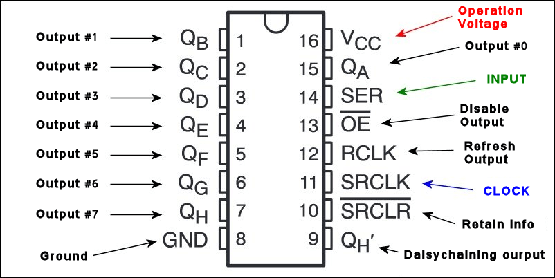

# 74hc595-driver

This repository contains micropython implementation of 74hc595 shift register driver.

## Usage
    
    
    from time import sleep
    from hc595 import Hc595
    
    # create shift register driver
    sr = Hc595(
        serial_in_pin=23,
        clock_pin=18,
        latch_pin=5,
    )
    
    sr.shiftout(pin=2, toggle = False, master_reset= False)

    # toggle output means that output will be toggled on each shiftout call on/off
    sr.shiftout(pin=2, toggle = True, master_reset= False)

    # master reset means that all outputs will be set to 0
    sr.shiftout(pin=2, toggle = True, master_reset= True)
